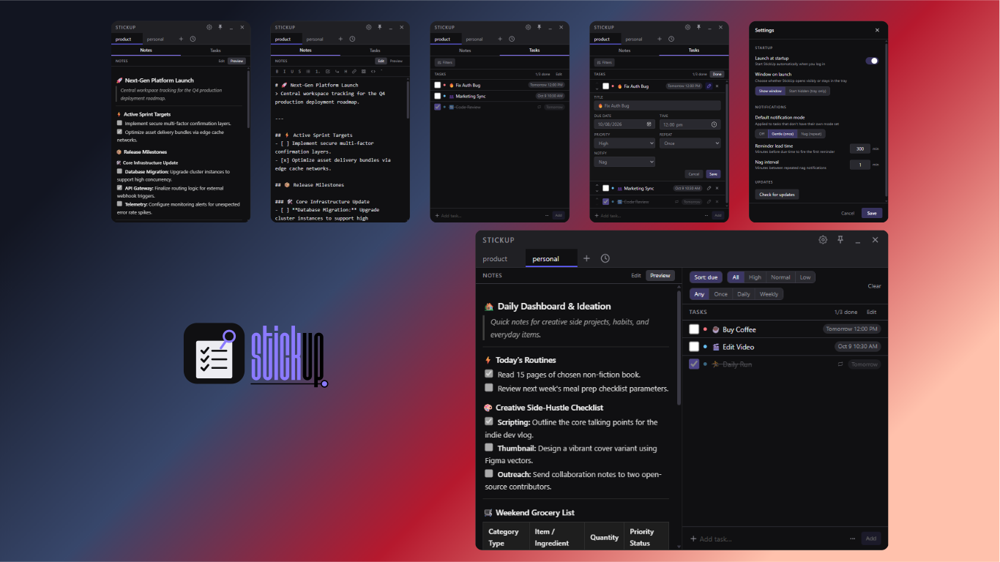

# 📌 StickUp!

### *Sticky notes that actually know what's due.*

 

---

> ### *"This is a StickUp! (Just kidding...) Gimme your notes and tasks."*

- **Tired of the clutter** of dozens of scattered sticky note windows?
- **Tired of switching tabs** and heavy workspace apps just to jot down a thought?
- **No notifications** when your task deadline is creeping up?

Most note-taking tools either clutter your desktop, force you to Alt-Tab away from your flow, or bury you under endless database features you never asked for.

**Meet StickUp!** A compact, distraction-free desktop companion that sits right where you work and does three things exceptionally well:

1. **Markdown Notes** — Jot ideas down in seconds with live preview, formatting, and syntax-highlighted code blocks.
2. **Interactive Checklists** — Check off tasks directly within your workflow.
3. **Due Dates, Recurrences & Reminders** — Keep critical deadlines in sight so nothing slips through the cracks.

---

## ✨ Key Features

- 📝 **Markdown-Powered Scratchpad**: Rich text support including headers, bold, italics, strikethrough, blockquotes, checklists, tables, and fenced code blocks with syntax highlighting.
- ⏰ **Deadlines & Recurring Routines**: Schedule due dates and times with automatic reset logic for daily and weekly recurring tasks.
- 🔔 **Native Windows Toast Notifications**: Background due-date alerts via native Windows toasts, featuring two distinct modes:
  - **Gentle Mode**: Alerts you once within your custom lead time.
  - **Nag Mode**: Persistently repeats reminders at set intervals until you check the task off.
- 🎯 **Priority & Filter Controls**: Prioritize tasks (`High`, `Normal`, `Low`) and quickly filter by due date, recurrence, or priority.
- 📌 **Always-on-Top Pin**: Toggle pin mode to keep StickUp floating comfortably above your active IDE, browser, or documents.
- 🗂️ **Per-Board Tab Organization**: Switch contexts instantly across tabbed boards with scoped notes and task lists. Includes an in-memory recently closed board recovery list.
- 🎛️ **Tray-Resident & Autostart**: Closing the window hides it to the system tray so background notification timers remain active; optional launch on Windows startup.
- 📐 **Adaptive Two-Pane Layout**: Seamlessly transitions from a compact single-column scratchpad (with a quick Notes/Tasks toggle) to a wide side-by-side view.
- 🔒 **Simple & Local-First by Design**:
  - **No Accounts or Cloud**: Zero sign-ups, zero telemetry, zero lock-in.
  - **Human-Readable Storage**: Every board is saved locally as a plain `.md` file with YAML frontmatter—safe, inspectable, and easy to back up.

---

## 🛠️ Tech Stack

- **Desktop Framework**: [Tauri v2](https://tauri.app/) (Rust backend for a tiny memory footprint and instant startup)
- **Frontend UI**: [React 19](https://react.dev/) + [TypeScript](https://www.typescriptlang.org/)
- **Styling**: [Tailwind CSS v4](https://tailwindcss.com/)
- **State Management**: [Zustand](https://github.com/pmndrs/zustand)
- **Markdown & Syntax Highlighting**: [markdown-it](https://github.com/markdown-it/markdown-it) & [highlight.js](https://highlightjs.org/)

---

## 🚀 Status

**v1.0.1 is officially released!** 🎉

StickUp is stable, local-first, and ready for daily use. Check out our [Releases page](https://github.com/wacxv/stickup/releases) to download the latest executable.

---

## 📄 License

This project is licensed under the [GNU General Public License v3.0 or later](LICENSE).